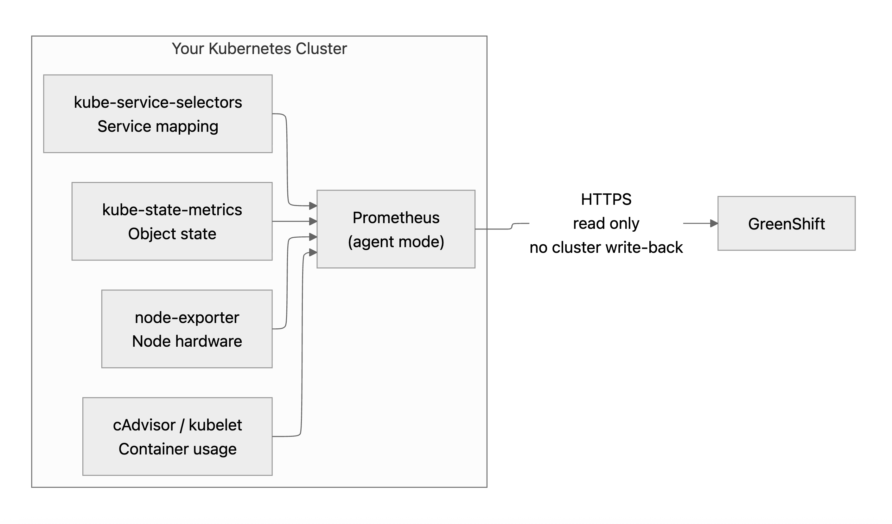
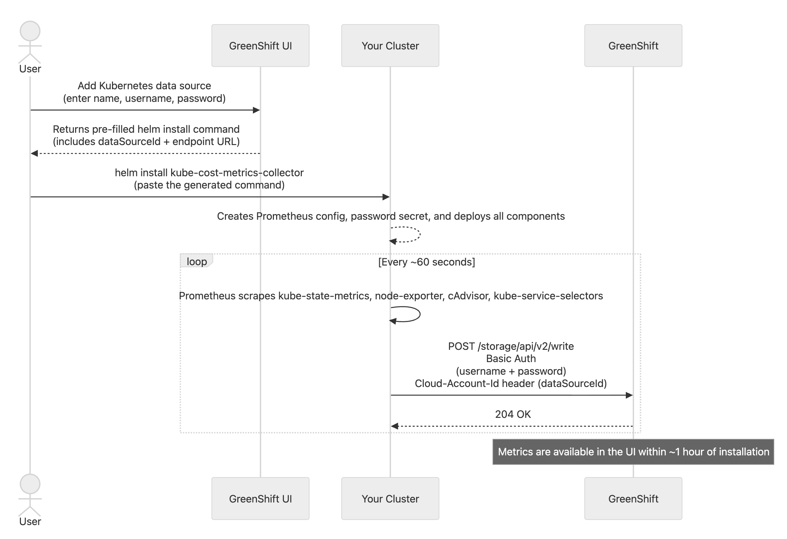
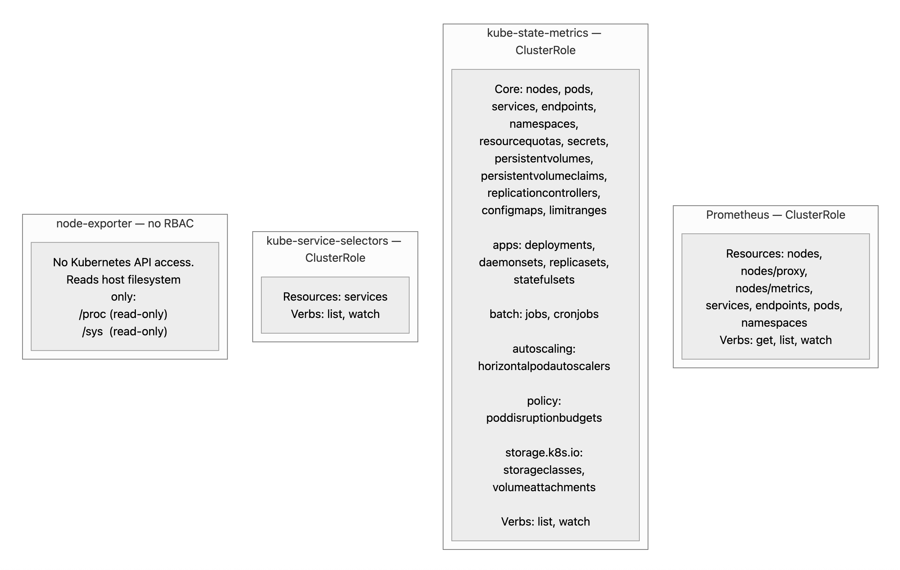

# GreenShift Helm Charts

Helm charts for connecting Kubernetes clusters to [GreenShift](https://greenshift.app) for cost management and FinOps.

## Architecture

The `kube-cost-metrics-collector` chart deploys a Prometheus stack in agent mode inside the clients' cluster. It scrapes resource metrics from cluster components and forwards them to GreenShift over HTTPS. Nothing is written back to the clients' cluster.



### Data collection

Four components feed metrics into Prometheus before they are remote-written to GreenShift:

| Component | What it provides |
|-----------|-----------------|
| **kube-state-metrics** | Kubernetes object state (pods, deployments, resource requests/limits, …) |
| **node-exporter** | Node-level hardware and OS metrics |
| **cAdvisor** (embedded in kubelet) | Per-container CPU, memory, and filesystem usage |
| **kube-service-selectors** | Service-to-pod label mappings for cost attribution |



## Connection setup

When a client adds a Kubernetes data source in the GreenShift UI, it generates a pre-filled `helm install` command containing the `dataSourceId` and the remote-write endpoint. After running that command, Prometheus begins scraping every ~60 seconds and metrics are available in the UI within ~1 hour.



## Prerequisites

- [Helm 3+](https://helm.sh/docs/intro/install/)

## Add the Repository

```bash
helm repo add greenshift https://greenshift-public-repos.github.io/helm-charts
helm repo update
```

## Available Charts

| Chart | Description |
|-------|-------------|
| [kube-cost-metrics-collector](charts/kube-cost-metrics-collector) | Collects Kubernetes resource metrics and forwards them to GreenShift |
| [kube-service-selectors](charts/kube-service-selectors) | Exports Kubernetes service selectors as metrics (installed automatically as a dependency) |

## Permissions

All access is read-only. The chart creates the following ClusterRoles:



- **node-exporter** requires no Kubernetes API access — it reads `/proc` and `/sys` from the host filesystem only.
- **kube-service-selectors** gets `list`/`watch` on `services`.
- **kube-state-metrics** gets `list`/`watch` across core workload, storage, and policy resources.
- **Prometheus** gets `get`/`list`/`watch` on nodes, node metrics/proxy endpoints, services, endpoints, pods, and namespaces (needed for service discovery and kubelet scraping).

No resources are ever created, updated, or deleted in the clients' cluster by any of these components.

## Uninstall

```bash
helm uninstall <release-name> --namespace greenshift
```
